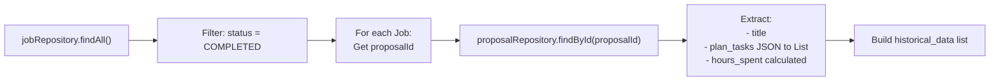

# Smart Proposal Generator — Architecture Deep Dive

This document answers four key architectural questions about how the Spring Boot backend and the FastAPI AI microservice interact, how data flows, and why the code is structured the way it is.

---

## Table of Contents

1. [How do the FastAPI calls actually take place?](#1-how-do-the-fastapi-calls-actually-take-place)
2. [Why do Plan & Research have Controller + Service, but others don't?](#2-why-do-plan--research-have-controller--service-but-others-dont)
3. [How does AgentOrchestratorService work? (Full Flowchart)](#3-how-does-agentorchestratorservice-work)
4. [How does the Executor Agent use data from Neon Postgres?](#4-how-does-the-executor-agent-use-data-from-neon-postgres)

---

## 1. How do the FastAPI calls actually take place?

### The Two Systems

There are **two separate servers** running:

| Server | Tech | Port | Role |
|---|---|---|---|
| **Spring Boot Backend** | Java / Spring Boot | `8080` | REST API for frontend, database access, workflow orchestration |
| **FastAPI AI Service** | Python / FastAPI | `8000` | LLM-powered AI agents (Planner, Researcher, Executor, Reflector) |

### The Bridge: `RestTemplate`

The Spring Boot backend calls FastAPI using Spring's **`RestTemplate`** — a synchronous HTTP client. Every AI agent call is essentially a `POST` request from Java to Python.

```
┌─────────────┐    HTTP POST    ┌─────────────────┐    LLM API     ┌─────────┐
│  Spring Boot │ ──────────────→│  FastAPI Service │ ──────────────→│ Gemini  │
│  (Java)      │ ←──────────────│  (Python)        │ ←──────────────│  LLM    │
│  Port 8080   │    JSON resp   │  Port 8000       │   JSON resp    │         │
└─────────────┘                 └─────────────────┘                └─────────┘
```

### Where are the URLs configured?

In [AgentOrchestratorService.java](file:///c:/Users/Nishit%20Kekane/Devzone/Smart_Proposal_Generation/Project/backend/src/main/java/com/proposal/backend/service/AgentOrchestratorService.java#L44-L63), each FastAPI endpoint is injected via `@Value`:

```java
@Value("${fastapi.plan-url:http://127.0.0.1:8000/plan}")
private String planUrl;

@Value("${fastapi.research-url:http://127.0.0.1:8000/research}")
private String researchUrl;

@Value("${fastapi.execute-pricing-url:http://127.0.0.1:8000/execute/pricing}")
private String executePricingUrl;

@Value("${fastapi.execute-draft-url:http://127.0.0.1:8000/execute/draft}")
private String executeDraftUrl;

@Value("${fastapi.reflect-review-url:http://127.0.0.1:8000/reflect/review}")
private String reflectReviewUrl;

@Value("${fastapi.execute-revise-url:http://127.0.0.1:8000/execute/revise}")
private String executeReviseUrl;
```

### Two Paths for FastAPI Calls

Here's the key insight: **FastAPI is called from TWO different places** in the Spring Boot backend, and they serve **different purposes**.

#### Path A: Via `PlanService` / `ResearchService` (Standalone Testing)

```
Frontend → PlanController → PlanService → RestTemplate.postForObject() → FastAPI /plan
Frontend → ResearchController → ResearchService → RestTemplate.postForObject() → FastAPI /research
```

These are **standalone REST endpoints** (`POST /api/plans/generate` and `POST /api/research`) that let you test the Planner and Researcher agents **independently**, without running the full workflow. Think of them as **debug/test endpoints**.

#### Path B: Via `AgentOrchestratorService` (Production Workflow)

```
Frontend → WorkflowController → AgentOrchestratorService → RestTemplate.postForObject() → FastAPI (multiple endpoints)
```

This is the **real production path**. The orchestrator chains ALL agent calls in sequence:
`/plan` → `/research` → `/execute/pricing` → `/execute/draft` → `/reflect/review` → `/execute/revise`

> **IMPORTANT:**
> **The actual call mechanism is identical in both paths** — `restTemplate.postForObject(url, requestBody, ResponseType.class)`. The difference is **who calls it** (a simple service vs. the orchestrator) and **what happens with the response** (returned directly vs. fed into the next stage).

### A Concrete Example: The Plan Call

**Path A** (standalone via [PlanService.java](file:///c:/Users/Nishit%20Kekane/Devzone/Smart_Proposal_Generation/Project/backend/src/main/java/com/proposal/backend/service/PlanService.java#L25-L27)):
```java
// Simple pass-through — returns typed DTO directly
public PlanResponseDto generatePlan(PlanRequestDto requestDto) {
    return restTemplate.postForObject(fastApiPlanUrl, requestDto, PlanResponseDto.class);
}
```

**Path B** (orchestrator via [AgentOrchestratorService.java](file:///c:/Users/Nishit%20Kekane/Devzone/Smart_Proposal_Generation/Project/backend/src/main/java/com/proposal/backend/service/AgentOrchestratorService.java#L98-L122)):
```java
// Builds a raw Map, calls FastAPI, then extracts ambiguities/tasks, saves to DB, notifies via WebSocket
Map<String, Object> planRequest = new HashMap<>();
planRequest.put("text", proposal.getCustomerRequirement());
Map<String, Object> planResponse = restTemplate.postForObject(planUrl, planRequest, Map.class);
List<String> ambiguities = (List<String>) planResponse.get("ambiguities");
// ...then decides whether to pause workflow or continue...
```

> **NOTE:**
> Notice that `PlanService` uses typed DTOs (`PlanRequestDto` → `PlanResponseDto`), while `AgentOrchestratorService` uses raw `Map<String, Object>`. This is because the orchestrator needs fine-grained control over what gets extracted and how the workflow branches.

---

## 2. Why do Plan & Research have Controller + Service, but others don't?

### The Current Structure

| Agent | Has Controller? | Has Dedicated Service? | Called From |
|---|---|---|---|
| **Planner** | ✅ `PlanController` | ✅ `PlanService` | Both standalone + orchestrator |
| **Researcher** | ✅ `ResearchController` | ✅ `ResearchService` | Both standalone + orchestrator |
| **Executor (Pricing)** | ❌ | ❌ | Orchestrator only |
| **Executor (Draft)** | ❌ | ❌ | Orchestrator only |
| **Reflector (Review)** | ❌ | ❌ | Orchestrator only |
| **Executor (Revise)** | ❌ | ❌ | Orchestrator only |

### Why this inconsistency?

There are two reasons, one practical and one evolutionary:

#### Reason 1: Development Chronology 🕐

Planner and Researcher were built **first**, as independent modules. During early development, they were tested as isolated REST endpoints — "send this text, get a plan" / "send these tasks, get research findings." They needed their own Controller + Service pairs so the frontend (or Postman) could call them directly.

Executor, Reflector, and Revise were added **later** as part of the full workflow pipeline. By that point, the `AgentOrchestratorService` already existed and handled all the chaining logic, so there was no need to expose them as separate REST endpoints.

#### Reason 2: Standalone Utility 🔧

Planner and Researcher are **useful on their own**:
- "I just want to detect ambiguities in this requirement" → `POST /api/plans/generate`
- "I just want research findings for these tasks" → `POST /api/research`

But Executor and Reflector **don't make sense alone**:
- Pricing needs rate cards + historical data from the DB (which only the orchestrator has)
- Drafting needs tasks + findings + selected pricing (accumulated from prior steps)
- Reflection needs the full context of what was generated
- Revision needs the reflector's feedback

These agents are **inherently dependent on prior workflow state**, so exposing them as standalone endpoints would require the caller to assemble all the accumulated context manually — which is exactly what the orchestrator does.

### Visual Summary

```
┌─────────────────────────────────────────────────────────────────────┐
│                        Spring Boot Backend                          │
│                                                                     │
│  ┌─── Standalone Endpoints ───┐   ┌─── Workflow Endpoint ────────┐ │
│  │                             │   │                              │ │
│  │  PlanController             │   │  WorkflowController          │ │
│  │    └→ PlanService           │   │    └→ AgentOrchestratorSvc   │ │
│  │        └→ FastAPI /plan     │   │        ├→ FastAPI /plan      │ │
│  │                             │   │        ├→ FastAPI /research  │ │
│  │  ResearchController         │   │        ├→ FastAPI /execute/* │ │
│  │    └→ ResearchService       │   │        └→ FastAPI /reflect/* │ │
│  │        └→ FastAPI /research │   │                              │ │
│  │                             │   │  (chains ALL agents + DB     │ │
│  │  (for testing/debugging)    │   │   + WebSocket notifications) │ │
│  └─────────────────────────────┘   └──────────────────────────────┘ │
└─────────────────────────────────────────────────────────────────────┘
```

> **TIP:** 
> **Is this a problem?** Not necessarily — but for consistency, you *could* create an `ExecutorService`, `ReflectorService`, etc. and have the orchestrator delegate to them. This would make unit testing easier and follow the Single Responsibility Principle more cleanly. But it's a design trade-off, not a bug.

---

## 3. How does AgentOrchestratorService work?

### Overview

The [AgentOrchestratorService](file:///c:/Users/Nishit%20Kekane/Devzone/Smart_Proposal_Generation/Project/backend/src/main/java/com/proposal/backend/service/AgentOrchestratorService.java) is the **brain of the application**. It manages the entire proposal generation lifecycle through a **state machine** where each state transition involves:

1. Calling a FastAPI AI agent
2. Saving results to the Neon Postgres database
3. Notifying the frontend via WebSocket
4. Deciding what to do next (continue, pause for user input, or retry)

### The Complete Workflow Flowchart

```mermaid
flowchart TD
    A["Frontend: POST /api/workflow/start/{id}"] --> B["startWorkflow(proposalId)"]
    B --> C["Load Proposal from DB"]
    C --> D["Create Job record - STARTED"]
    D --> E["Set status = PROCESSING"]
    E --> F["POST /plan\n{text: customerRequirement}"]
    
    F --> G{Ambiguities found?}
    
    G -- Yes --> H["Set status = PENDING_CLARIFICATION\nSave ambiguities to DB"]
    H --> I["WebSocket: ambiguities_received\nWORKFLOW PAUSES"]
    I --> J["User answers in frontend"]
    J --> K["Frontend: POST /api/workflow/clarify/{id}"]
    K --> L["submitClarifications()"]
    L --> M["POST /plan\n{text, answers, ambiguities_snapshot}"]
    M --> N["Save tasks to DB"]
    
    G -- No --> N2["Extract tasks from response\nSave tasks to DB"]
    
    N --> O["continueAfterPlanFinalized()"]
    N2 --> O
    
    O --> P["POST /research\n{tasks, context}"]
    P --> Q["Save findings to DB"]
    
    Q --> R["Fetch RateCard from DB\nFetch historical Jobs from DB"]
    R --> S["POST /execute/pricing\n{tasks, findings, rate_card, historical_data}"]
    S --> T["Save pricing tiers to DB\nSet status = PENDING_PRICING"]
    T --> U["WebSocket: pending_pricing\nWORKFLOW PAUSES"]
    
    U --> V["User selects pricing tier"]
    V --> W["Frontend: POST /api/workflow/pricing/{id}"]
    W --> X["finalizePricing()"]
    X --> Y["POST /execute/draft\n{tasks, findings, selected_pricing}"]
    Y --> Z["Enter Reflection Loop"]
    
    Z --> AA["POST /reflect/review\n{tasks, findings, pricing, draft}"]
    AA --> AB{Verdict?}
    
    AB -- PASS --> AC["Save draft to DB\nSet status = PENDING_DRAFT_APPROVAL"]
    AB -- "FAIL and retries left" --> AD["POST /execute/revise\n{..., revision_instructions}"]
    AD --> Z
    AB -- "FAIL and no retries" --> AC
    
    AC --> AE["WebSocket: pending_draft_approval\nWORKFLOW PAUSES"]
    AE --> AF["User reviews and approves"]
    AF --> AG["Frontend: POST /api/workflow/approve/{id}"]
    AG --> AH["approveProposal()"]
    AH --> AI["Save final proposal\nSet status = COMPLETED\nUpdate Job = COMPLETED"]
    AI --> AJ["WebSocket: completed"]
```



### Function-by-Function Breakdown

#### 1️⃣ `startWorkflow(UUID proposalId)` — [Lines 80-128](file:///c:/Users/Nishit%20Kekane/Devzone/Smart_Proposal_Generation/Project/backend/src/main/java/com/proposal/backend/service/AgentOrchestratorService.java#L80-L128)

| Aspect | Detail |
|---|---|
| **Triggered by** | `POST /api/workflow/start/{proposalId}` |
| **Annotation** | `@Async` — runs on a separate thread so the HTTP response returns immediately |
| **FastAPI called** | `POST http://127.0.0.1:8000/plan` |
| **Request sent** | `{ "text": "<customer requirement>" }` |
| **Response expected** | `{ "stage": "AMBIGUITIES", "ambiguities": [...], "tasks": [...] }` |
| **Decision logic** | If `ambiguities` is non-empty → pause and ask user. If empty → extract `tasks` and continue. |
| **WebSocket events** | `planner_phase1_running`, then either `ambiguities_received` (pause) or continues to research |

#### 2️⃣ `submitClarifications(UUID proposalId, ...)` — [Lines 134-163](file:///c:/Users/Nishit%20Kekane/Devzone/Smart_Proposal_Generation/Project/backend/src/main/java/com/proposal/backend/service/AgentOrchestratorService.java#L134-L163)

| Aspect | Detail |
|---|---|
| **Triggered by** | `POST /api/workflow/clarify/{proposalId}` |
| **Request body from frontend** | `{ "answers": ["...", "..."], "ambiguities": ["...", "..."] }` |
| **FastAPI called** | `POST http://127.0.0.1:8000/plan` (same URL, Phase 2 this time) |
| **Request sent** | `{ "text": "<requirement>", "answers": [...], "ambiguities_snapshot": [...] }` |
| **Response expected** | `{ "stage": "FINALIZED", "ambiguities": [], "tasks": ["Task 1", "Task 2", ...] }` |
| **Next step** | Calls `continueAfterPlanFinalized()` |

#### 3️⃣ `continueAfterPlanFinalized(Proposal, List<String> tasks)` — [Lines 165-216](file:///c:/Users/Nishit%20Kekane/Devzone/Smart_Proposal_Generation/Project/backend/src/main/java/com/proposal/backend/service/AgentOrchestratorService.java#L165-L216)

This is the **core pipeline** that runs Research → Pricing in sequence.

**Step A — Research:**

| Aspect | Detail |
|---|---|
| **FastAPI called** | `POST http://127.0.0.1:8000/research` |
| **Request sent** | `{ "tasks": [...], "context": { "project_title": "..." } }` |
| **Response expected** | `{ "findings": [{ "task_reference": "...", "insight": "...", "confidence": "high" }], "sources": [...] }` |

**Step B — Pricing:**

| Aspect | Detail |
|---|---|
| **DB reads** | `rateCardRepository.findAll()` → fetches all rate cards; `fetchHistoricalProjects()` → fetches completed jobs + their proposals |
| **FastAPI called** | `POST http://127.0.0.1:8000/execute/pricing` |
| **Request sent** | `{ "tasks": [...], "findings": [...], "rate_card": [...], "historical_data": [...] }` |
| **Response expected** | `{ "tiers": { "conservative": {...}, "standard": {...}, "aggressive": {...} } }` |
| **WebSocket event** | `pending_pricing` (pauses for user to select a tier) |

#### 4️⃣ `finalizePricing(UUID proposalId, ...)` — [Lines 228-321](file:///c:/Users/Nishit%20Kekane/Devzone/Smart_Proposal_Generation/Project/backend/src/main/java/com/proposal/backend/service/AgentOrchestratorService.java#L228-L321)

This is the **most complex method** — it generates the draft, then enters a reflection-revision loop.

**Step A — Generate Draft:**

| Aspect | Detail |
|---|---|
| **FastAPI called** | `POST http://127.0.0.1:8000/execute/draft` |
| **Request sent** | `{ "tasks": [...], "findings": [...], "selected_pricing": { "tier_name": "standard", "total_hours": 120, "total_cost": 12000, ... } }` |
| **Response expected** | `{ "draft": "<full markdown proposal text>" }` |

**Step B — Reflection Loop (max 3 retries):**

```
┌─────────────────────────────────────────────────┐
│              REFLECTION LOOP                     │
│                                                  │
│  ┌──────────────┐      ┌───────────────┐        │
│  │ POST /reflect│      │ POST /execute │        │
│  │   /review    │─FAIL→│   /revise     │──┐     │
│  │              │      │               │  │     │
│  └──────┬───────┘      └───────────────┘  │     │
│         │                                  │     │
│        PASS                            new draft │
│         │                                  │     │
│         ▼                                  │     │
│    Save & Notify                    Loop back    │
│                                                  │
│  Max retries: 3 (configurable)                   │
└─────────────────────────────────────────────────┘
```

| Iteration | FastAPI call | Request | Response |
|---|---|---|---|
| Review | `POST /reflect/review` | `{ tasks, findings, selected_pricing, draft, retry_attempt }` | `{ "verdict": "PASS"/"FAIL", "overall_score": 85, "issues": [...], "revision_instructions": "..." }` |
| Revise (if FAIL) | `POST /execute/revise` | `{ tasks, findings, selected_pricing, previous_draft, revision_instructions, retry_attempt }` | `{ "draft": "<improved draft>" }` |

#### 5️⃣ `approveProposal(UUID proposalId, String finalDraft)` — [Lines 327-350](file:///c:/Users/Nishit%20Kekane/Devzone/Smart_Proposal_Generation/Project/backend/src/main/java/com/proposal/backend/service/AgentOrchestratorService.java#L327-L350)

| Aspect | Detail |
|---|---|
| **Triggered by** | `POST /api/workflow/approve/{proposalId}` |
| **FastAPI called** | None — this is purely a DB operation |
| **Actions** | Saves `finalProposal`, sets status to `COMPLETED`, updates `Job` record with `completedAt` timestamp |
| **WebSocket event** | `completed` |

### The 3 Pause Points (Human-in-the-Loop)

The workflow **pauses 3 times** waiting for user input:

| Pause Point | Status | WebSocket Event | Resumes Via |
|---|---|---|---|
| After ambiguities detected | `PENDING_CLARIFICATION` | `ambiguities_received` | `POST /api/workflow/clarify/{id}` |
| After pricing tiers generated | `PENDING_PRICING` | `pending_pricing` | `POST /api/workflow/pricing/{id}` |
| After draft generated and reviewed | `PENDING_DRAFT_APPROVAL` | `pending_draft_approval` | `POST /api/workflow/approve/{id}` |

### WebSocket Communication

The [WorkflowWebSocketHandler](file:///c:/Users/Nishit%20Kekane/Devzone/Smart_Proposal_Generation/Project/backend/src/main/java/com/proposal/backend/config/WorkflowWebSocketHandler.java) manages real-time updates. The frontend connects via:

```
ws://localhost:8080/ws/workflow?proposalId=<uuid>
```

Every status change sends a JSON message:
```json
{
  "proposalId": "abc-123",
  "status": "pending_pricing",
  "payload": {
    "tiers": { "conservative": {}, "standard": {}, "aggressive": {} },
    "tasks": ["Task 1", "Task 2"],
    "findings": []
  }
}
```

---

## 4. How does the Executor Agent use data from Neon Postgres?

The Executor Agent (specifically the **Pricing** endpoint) is the only AI agent that receives data originating from the database. Here's exactly how it works:

### What data comes from the DB?

Two types of data are fetched from Neon Postgres and sent to the Executor:

#### A. Rate Cards (`rate_card` table)

The [RateCard](file:///c:/Users/Nishit%20Kekane/Devzone/Smart_Proposal_Generation/Project/backend/src/main/java/com/proposal/backend/entity/RateCard.java) entity represents your company's pricing catalog — hourly rates for different roles/services.

**DB Schema:**
| Column | Type | Example |
|---|---|---|
| `id` | UUID | `550e8400-...` |
| `item_name` | String | `"Senior Developer"` |
| `category` | String | `"Engineering"` |
| `unit` | String | `"Hour"` |
| `price` | Decimal | `150.00` |
| `currency` | String | `"USD"` |
| `effective_date` | Date | `2025-01-01` |

**How it's fetched and transformed** — [Lines 183-195](file:///c:/Users/Nishit%20Kekane/Devzone/Smart_Proposal_Generation/Project/backend/src/main/java/com/proposal/backend/service/AgentOrchestratorService.java#L183-L195):

```java
List<RateCard> rawRateCards = rateCardRepository.findAll();  // SQL: SELECT * FROM rate_card

// Transform to plain Map for JSON serialization
for (RateCard rc : rawRateCards) {
    Map<String, Object> item = new HashMap<>();
    item.put("item_name", rc.getItemName());    // "Senior Developer"
    item.put("category", rc.getCategory());      // "Engineering"
    item.put("unit", rc.getUnit());              // "Hour"
    item.put("price", rc.getPrice());            // 150.00
    item.put("currency", rc.getCurrency());      // "USD"
    rateCardsList.add(item);
}
```

#### B. Historical Projects (from `jobs` + `proposals` tables)

The [fetchHistoricalProjects()](file:///c:/Users/Nishit%20Kekane/Devzone/Smart_Proposal_Generation/Project/backend/src/main/java/com/proposal/backend/service/AgentOrchestratorService.java#L352-L388) method builds a list of **past completed proposals** with their task breakdowns and actual hours spent.

**How it works step-by-step:**



**Hours calculation** — [Lines 367-371](file:///c:/Users/Nishit%20Kekane/Devzone/Smart_Proposal_Generation/Project/backend/src/main/java/com/proposal/backend/service/AgentOrchestratorService.java#L367-L371):

```java
// Hours = time between job start and completion
double hoursSpent = 40.0;  // default fallback
if (job.getStartedAt() != null && job.getCompletedAt() != null) {
    long minutes = Duration.between(job.getStartedAt(), job.getCompletedAt()).toMinutes();
    hoursSpent = Math.max(1.0, minutes / 60.0);
}
```

### The Complete Data Flow to Executor Pricing

```
┌──────────────────────────────────────────────────────────────────┐
│                     NEON POSTGRES DB                              │
│                                                                  │
│  ┌──────────────┐    ┌──────────────┐    ┌───────────────┐      │
│  │  rate_card    │    │    jobs       │    │   proposals    │      │
│  │              │    │              │    │              │      │
│  │  item_name    │    │  proposal_id ─┼───→│  title         │      │
│  │  category     │    │  status       │    │  plan_tasks    │      │
│  │  unit         │    │  started_at   │    │  ...           │      │
│  │  price        │    │  completed_at │    │                │      │
│  │  currency     │    │               │    │                │      │
│  └──────┬───────┘    └──────┬───────┘    └───────┬───────┘      │
│         │                   │                     │              │
└─────────┼───────────────────┼─────────────────────┼──────────────┘
          │                   │                     │
          ▼                   └──────────┬──────────┘
   rate_card list              historical_data list
          │                             │
          ▼                             ▼
┌─────────────────────────────────────────────────────────────────┐
│          AgentOrchestratorService (Java)                         │
│                                                                 │
│  Assembles the complete request:                                │
│  {                                                              │
│    "tasks": ["Task 1", "Task 2"],         ← from prior plan    │
│    "findings": [{...}, {...}],            ← from prior research │
│    "rate_card": [                                               │
│      {"item_name": "Senior Dev", "price": 150, "unit": "Hour"} │
│    ],                                                           │
│    "historical_data": [                    ← from DB            │
│      {"title": "Past Project",                                  │
│       "tasks": [...], "hours_spent": 80}                        │
│    ]                                                            │
│  }                                                              │
└────────────────────────────┬────────────────────────────────────┘
                             │
                    POST /execute/pricing
                             │
                             ▼
┌─────────────────────────────────────────────────────────────────┐
│          FastAPI Executor Agent (Python)                         │
│                                                                 │
│  1. Loads executor_pricing_prompt.txt (system prompt)           │
│  2. Serializes the full request as JSON user prompt             │
│  3. Sends to Gemini LLM                                        │
│  4. LLM generates 3 pricing tiers using:                       │
│     - Rate cards → to calculate per-role costs                  │
│     - Historical data → to calibrate hour estimates             │
│     - Tasks + findings → to scope the work                     │
│  5. Returns structured pricing response                         │
└─────────────────────────────────────────────────────────────────┘
```

### What exactly does the LLM receive from the DB?

Here's an example of the JSON payload the Executor Pricing agent's LLM sees as its user prompt:

```json
{
  "tasks": [
    "Design microservices architecture for order management",
    "Implement payment gateway integration with Stripe",
    "Set up CI/CD pipeline with automated testing"
  ],
  "findings": [
    {
      "task_reference": "Task 2",
      "insight": "Stripe charges 2.9% + 30c per transaction. SDK available for Java and Node.js.",
      "confidence": "high"
    }
  ],
  "rate_card": [
    { "item_name": "Senior Developer", "category": "Engineering", "unit": "Hour", "price": 150.0, "currency": "USD" },
    { "item_name": "Junior Developer", "category": "Engineering", "unit": "Hour", "price": 75.0, "currency": "USD" },
    { "item_name": "DevOps Engineer", "category": "Infrastructure", "unit": "Hour", "price": 130.0, "currency": "USD" }
  ],
  "historical_data": [
    {
      "title": "E-Commerce Platform v2",
      "tasks": ["Design REST API", "Implement auth", "Deploy to AWS"],
      "hours_spent": 120.5
    }
  ]
}
```

The LLM uses this to produce **three pricing tiers** (conservative, standard, aggressive), each with role-based hour breakdowns, total costs, and rationale — all grounded in your **actual company rates** and **past project durations**.

> **IMPORTANT:**
> **The FastAPI/Python side has NO direct access to the database.** All DB data flows through the Java orchestrator, which reads from Neon Postgres, transforms it into JSON, and sends it as part of the HTTP request body. The AI service is **stateless** — it receives everything it needs in each request.

### Summary: What each DB table contributes

| DB Table | Used By | Purpose in AI Pipeline |
|---|---|---|
| `proposals` | Orchestrator (all stages) | Stores accumulated state: requirements, tasks, findings, pricing, drafts |
| `rate_card` | Executor (Pricing) | Provides real company pricing rates for cost estimation |
| `jobs` | Executor (Pricing) + Approval | Historical project durations for calibrating hour estimates |
| `users` | ProposalService | Associates proposals with authenticated users |

---

## Quick Reference: All FastAPI Endpoints

| FastAPI Endpoint | Agent | Called From (Java) | What it does |
|---|---|---|---|
| `POST /plan` | Planner | `AgentOrchestratorService`, `PlanService` | Phase 1: detects ambiguities. Phase 2: finalizes task list. |
| `POST /research` | Researcher | `AgentOrchestratorService`, `ResearchService` | Derives queries, web search, synthesizes findings |
| `POST /execute/pricing` | Executor | `AgentOrchestratorService` only | Generates 3 pricing tiers using rate cards + history |
| `POST /execute/draft` | Executor | `AgentOrchestratorService` only | Generates full proposal draft in markdown |
| `POST /reflect/review` | Reflector | `AgentOrchestratorService` only | Reviews draft quality, returns PASS/FAIL + score |
| `POST /execute/revise` | Executor | `AgentOrchestratorService` only | Revises draft based on reflector's feedback |

---

## Quick Reference: All Spring Boot REST Endpoints

| Spring Boot Endpoint | Controller | Purpose |
|---|---|---|
| `POST /api/proposals` | `ProposalController` | Create a new proposal |
| `GET /api/proposals/{id}` | `ProposalController` | Get proposal by ID |
| `GET /api/proposals` | `ProposalController` | List all proposals |
| `POST /api/plans/generate` | `PlanController` | Standalone plan generation (testing) |
| `POST /api/research` | `ResearchController` | Standalone research (testing) |
| `POST /api/workflow/start/{id}` | `WorkflowController` | Start full AI workflow |
| `POST /api/workflow/clarify/{id}` | `WorkflowController` | Submit clarification answers |
| `POST /api/workflow/pricing/{id}` | `WorkflowController` | Select a pricing tier |
| `POST /api/workflow/approve/{id}` | `WorkflowController` | Approve final proposal |
| `ws://localhost:8080/ws/workflow?proposalId=<id>` | WebSocket | Real-time status updates |
