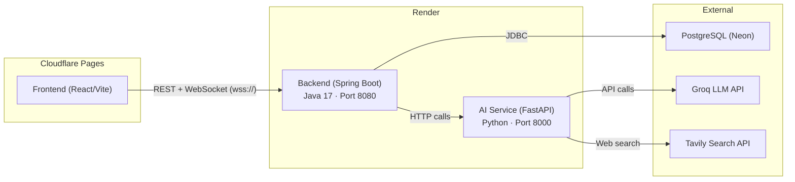

# 🚀 Deployment Guide — Render (Backend + AI Service)

> **Frontend** is already live at:  
> `https://ai-driven-proposal-generator2.nishit-kekane04.workers.dev` (Cloudflare Pages)

This guide walks you through deploying the **Spring Boot Backend** and the **FastAPI AI Service** to [Render](https://render.com).

---

## Architecture Overview



---

## Prerequisites

| Item | Details |
|------|---------|
| **Render Account** | Free tier works for both services ([render.com](https://render.com)) |
| **GitHub Repo** | Your code pushed to GitHub (Render deploys from Git) |
| **Neon DB** | Already configured — your PostgreSQL on Neon is working |
| **API Keys** | `GROQ_API_KEY`, `TAVILY_API_KEY`, `JWT_SECRET` ready |

---

## Part 1 — Deploy the FastAPI AI Service

> **Why deploy this first?** The Spring Boot backend calls the AI service via HTTP. You'll need the AI service URL to configure the backend.

### Step 1.1 — Create a `Dockerfile` for the AI Service

Create this file at `proposal-ai-service/Dockerfile`:

```dockerfile
# ── Stage: Runtime ─────────────────────────────────────────────────────────
FROM python:3.11-slim

WORKDIR /app

# Install dependencies
COPY requirements.txt .
RUN pip install --no-cache-dir -r requirements.txt

# Copy application code
COPY . .

# Expose port (Render uses PORT env variable)
EXPOSE 8000

# Run uvicorn — Render injects $PORT automatically
CMD ["sh", "-c", "uvicorn app.main:app --host 0.0.0.0 --port ${PORT:-8000}"]
```

### Step 1.2 — Create the Service on Render

1. Go to [Render Dashboard](https://dashboard.render.com) → **New** → **Web Service**
2. Connect your **GitHub repository**
3. Configure:

| Setting | Value |
|---------|-------|
| **Name** | `proposal-ai-service` |
| **Region** | Oregon (US West) — or closest to your Neon DB |
| **Root Directory** | `proposal-ai-service` |
| **Runtime** | Docker |
| **Instance Type** | Free (or Starter $7/mo for no cold starts) |

### Step 1.3 — Set Environment Variables

In the Render service settings, go to **Environment** and add:

| Key | Value | Notes |
|-----|-------|-------|
| `GROQ_API_KEY` | `gsk_4o7CTMHr3Ob...` | Your Groq API key |
| `BASE_URL` | `https://api.groq.com/openai/v1` | Groq endpoint |
| `MODEL` | `openai/gpt-oss-120b` | LLM model name |
| `REQUEST_TIMEOUT` | `40` | Timeout in seconds |
| `SEARCH_PROVIDER` | `tavily` | Or `ddg` for free fallback |
| `TAVILY_API_KEY` | `tvly-dev-...` | Only if using Tavily |

> **⚠️ CAUTION: Never commit real API keys to Git.** Your `.env` file is already in `.gitignore` — keep it that way. Only set secrets via the Render dashboard.

### Step 1.4 — Deploy & Verify

- Click **Create Web Service** — Render will build and deploy automatically
- After deploy, your AI service will be live at something like:
  ```
  https://proposal-ai-service-xxxx.onrender.com
  ```
- Verify by visiting:
  - `https://proposal-ai-service-xxxx.onrender.com/` → should return JSON with status `running`
  - `https://proposal-ai-service-xxxx.onrender.com/health` → should return `{"status": "UP"}`
  - `https://proposal-ai-service-xxxx.onrender.com/docs` → FastAPI Swagger UI

> **📝 NOTE: Copy the deployed URL** — you'll need it for the backend's `FASTAPI_*_URL` environment variables in Part 2.

---

## Part 2 — Deploy the Spring Boot Backend

### Step 2.1 — Create a `Dockerfile` for the Backend

Create this file at `backend/Dockerfile`:

```dockerfile
# ── Stage 1: Build ─────────────────────────────────────────────────────────
FROM eclipse-temurin:17-jdk-alpine AS build

WORKDIR /app

# Copy Maven wrapper and pom.xml first (cache dependencies)
COPY .mvn/ .mvn/
COPY mvnw pom.xml ./
RUN chmod +x mvnw
RUN ./mvnw dependency:resolve -B

# Copy source and build
COPY src/ src/
RUN ./mvnw package -DskipTests -B

# ── Stage 2: Runtime ──────────────────────────────────────────────────────
FROM eclipse-temurin:17-jre-alpine

WORKDIR /app

COPY --from=build /app/target/*.jar app.jar

EXPOSE 8080

# Render injects $PORT automatically
ENTRYPOINT ["sh", "-c", "java -jar app.jar --server.port=${PORT:-8080}"]
```

> **💡 TIP:** This is a **multi-stage build** — the final image is ~200MB (JRE only) instead of ~500MB (full JDK). This means faster deploys and lower memory usage.

### Step 2.2 — Create the Service on Render

1. Go to [Render Dashboard](https://dashboard.render.com) → **New** → **Web Service**
2. Connect the **same GitHub repository**
3. Configure:

| Setting | Value |
|---------|-------|
| **Name** | `proposal-backend` |
| **Region** | Same region as the AI Service |
| **Root Directory** | `backend` |
| **Runtime** | Docker |
| **Instance Type** | Free (or Starter $7/mo) |

### Step 2.3 — Set Environment Variables

Replace `<AI_SERVICE_URL>` with the URL from Part 1 (e.g., `https://proposal-ai-service-xxxx.onrender.com`).

| Key | Value | Notes |
|-----|-------|-------|
| `PORT` | `8080` | Render may override this |
| `SPRING_DATASOURCE_URL` | `jdbc:postgresql://ep-wispy-heart-...neondb?sslmode=require` | Your Neon DB URL |
| `SPRING_DATASOURCE_USERNAME` | `neondb_owner` | Neon DB username |
| `SPRING_DATASOURCE_PASSWORD` | Your Neon DB password | Neon DB password |
| `JWT_SECRET` | Your JWT signing key | JWT signing key |
| `FASTAPI_PLAN_URL` | `<AI_SERVICE_URL>/plan` | AI planner endpoint |
| `FASTAPI_RESEARCH_URL` | `<AI_SERVICE_URL>/research` | AI research endpoint |
| `FASTAPI_EXECUTE_PRICING_URL` | `<AI_SERVICE_URL>/execute/pricing` | AI pricing endpoint |
| `FASTAPI_EXECUTE_DRAFT_URL` | `<AI_SERVICE_URL>/execute/draft` | AI draft endpoint |
| `FASTAPI_REFLECT_REVIEW_URL` | `<AI_SERVICE_URL>/reflect/review` | AI review endpoint |
| `FASTAPI_EXECUTE_REVISE_URL` | `<AI_SERVICE_URL>/execute/revise` | AI revise endpoint |

### Step 2.4 — Deploy & Verify

- Click **Create Web Service** — Render will build the JAR and deploy
- Your backend will be live at something like:
  ```
  https://proposal-backend-xxxx.onrender.com
  ```
- Test endpoints:
  - `POST https://proposal-backend-xxxx.onrender.com/auth/register` — should work
  - `POST https://proposal-backend-xxxx.onrender.com/auth/login` — should work
  - WebSocket: `wss://proposal-backend-xxxx.onrender.com/ws/workflow?proposalId=<uuid>` — should connect

---

## Part 3 — Update Frontend Environment Variables

After both services are deployed, update your **Cloudflare Pages** environment variables:

1. Go to [Cloudflare Dashboard](https://dash.cloudflare.com) → Pages → your project → **Settings** → **Environment Variables**
2. Set these for the **Production** environment:

| Key | Value |
|-----|-------|
| `VITE_API_BASE_URL` | `https://proposal-backend-xxxx.onrender.com` |
| `VITE_WS_BASE_URL` | `wss://proposal-backend-xxxx.onrender.com/ws/workflow` |

3. **Trigger a redeploy** of the frontend so the new env vars take effect

> **⚡ IMPORTANT:** The WebSocket URL **must** use `wss://` (not `ws://`) in production since Render serves over HTTPS. Your frontend hook in `useWorkflowWebSocket.js` already handles this automatically by deriving `wss://` from `https://` in `VITE_API_BASE_URL`.

---

## Part 4 — CORS Configuration (Already Done ✅)

Your backend's `SecurityConfig.java` already includes the Cloudflare Pages origin:

```java
config.setAllowedOriginPatterns(List.of(
    "http://localhost:*",
    "http://127.0.0.1:*",
    "https://ai-driven-proposal-generator2.nishit-kekane04.workers.dev",
    "*"
));
```

And your `WebSocketConfig.java` allows all origins with `.setAllowedOriginPatterns("*")`.

Your AI service's `main.py` also has a permissive `allow_origin_regex` pattern.

> **⚠️ WARNING: For production hardening**, you should replace the wildcard `"*"` in `SecurityConfig.java` with only your specific frontend domain. The `"*"` combined with `allowCredentials=true` can be a security concern. Similarly, tighten the AI service CORS to only allow the backend's Render URL.

---

## Part 5 — Render Free Tier Considerations

> **⚠️ Cold Starts**: Render's free tier spins down services after 15 minutes of inactivity. The first request after a cold start can take **30–60 seconds** as the container restarts.

| Issue | Impact | Mitigation |
|-------|--------|------------|
| **Backend cold start** | ~30s for JVM startup | Use Starter tier ($7/mo) for always-on |
| **AI service cold start** | ~10–15s for Python startup | Use Starter tier ($7/mo) for always-on |
| **Request timeouts** | AI calls may timeout during cold starts | Increase `REQUEST_TIMEOUT` to 120s |
| **Monthly free hours** | 750 hours total across all free services | Monitor usage in Render dashboard |

### Optional: Keep-Alive Cron (Prevent Cold Starts on Free Tier)

You can set up a free cron job using [cron-job.org](https://cron-job.org) to ping both services every 14 minutes:

- **Backend**: `GET https://proposal-backend-xxxx.onrender.com/auth/login` (will return 405 but keeps the service alive)
- **AI Service**: `GET https://proposal-ai-service-xxxx.onrender.com/health`

---

## Deployment Checklist

```
Pre-deployment:
  [ ] Code pushed to GitHub
  [ ] API keys ready (GROQ_API_KEY, TAVILY_API_KEY, JWT_SECRET)
  [ ] Neon DB credentials confirmed

AI Service (Deploy First):
  [ ] Create proposal-ai-service/Dockerfile
  [ ] Create Render Web Service (Docker runtime, root dir: proposal-ai-service)
  [ ] Set environment variables (GROQ_API_KEY, BASE_URL, MODEL, etc.)
  [ ] Deploy and verify /health endpoint
  [ ] Copy the deployed URL

Backend (Deploy Second):
  [ ] Create backend/Dockerfile
  [ ] Create Render Web Service (Docker runtime, root dir: backend)
  [ ] Set environment variables (DB creds, JWT_SECRET, FASTAPI_*_URLs)
  [ ] Deploy and verify /auth/register endpoint
  [ ] Test WebSocket connection

Frontend (Update Last):
  [ ] Set VITE_API_BASE_URL in Cloudflare Pages env vars
  [ ] Set VITE_WS_BASE_URL in Cloudflare Pages env vars
  [ ] Trigger a redeploy on Cloudflare Pages
  [ ] Test full end-to-end flow

Post-deployment:
  [ ] Verify login/register works from the live frontend
  [ ] Verify proposal creation triggers the AI workflow via WebSocket
  [ ] (Optional) Set up keep-alive cron jobs
  [ ] (Optional) Tighten CORS for production security
```

---

## Quick Reference — Deployed URLs

| Service | URL |
|---------|-----|
| **Frontend** | `https://ai-driven-proposal-generator2.nishit-kekane04.workers.dev` |
| **Backend** | `https://proposal-backend-xxxx.onrender.com` *(update after deploy)* |
| **AI Service** | `https://proposal-ai-service-xxxx.onrender.com` *(update after deploy)* |
| **AI Docs** | `https://proposal-ai-service-xxxx.onrender.com/docs` *(Swagger UI)* |
| **Database** | Neon PostgreSQL (already connected) |
