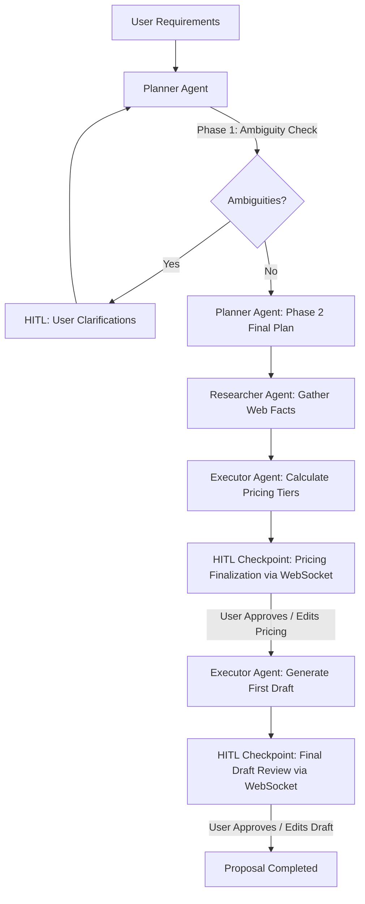

# Add Executor Agent & Real-time WebSocket Checkpoints (Refactored with Neon Postgres MCP)

We will extend the multi-agent proposal generation workflow by adding an **Executor Agent** that estimates project hours, calculates three pricing tiers (Conservative, Standard, Aggressive) based on active rate cards and historical project hours, and writes the first draft of the proposal.

We will map the Neon Postgres database tables, set up a real-time WebSocket communication channel in Spring Boot, and build React UI elements to support two Human-in-the-Loop (HITL) checkpoints: **Pricing Finalization** and **Final Draft Approval**. 

Additionally, we leverage **Neon Postgres MCP** capabilities directly during development and testing to inspect table structures, verify data consistency, query historical job durations, and seed/update pricing metrics.



---

## User Review Required

> [!IMPORTANT]
> - **WebSocket Security**: The WebSocket endpoint (`ws://localhost:8080/ws/workflow`) will bypass standard JWT headers and validate using a JWT query parameter `?token=...` during the connection handshake.
> - **Orchestration Model**: The workflow is run asynchronously on the Spring Boot backend using a task executor thread, returning a `jobId` immediately. WebSocket pushes state transitions (`PENDING_PRICING`, `PENDING_DRAFT_APPROVAL`) to the React app in real time.
> - **Neon Postgres MCP Usage**: We will use MCP commands to verify DB schema, verify seeder execution, and manually inspect the `rate_card` prices and `jobs` timestamps directly without needing custom DB administration clients.

---

## Open Questions

> [!NOTE]
> 1. **How should historical hours be retrieved and matched?**
>    - *Proposed Approach*: The Spring Boot backend will fetch completed jobs (calculating their duration as `completed_at - started_at` in hours) and match the new proposal's title and requirements against historical completed proposals using basic SQL keyword similarity. We will pass this historical hours list along with the active rate cards to the FastAPI Executor Agent, letting the LLM identify similar tasks and map historical hours.
> 2. **What defaults should be used if there is no historical data?**
>    - *Proposed Approach*: If the database has no completed jobs, the LLM will fall back to estimating standard task hours based solely on the finalized task list complexity and standard rate card items.

---

## Proposed Changes

### Component 1: Neon Postgres Schema Validation & Direct Seed (via MCP)
We will use Neon Postgres MCP tools to verify table columns and seed initial rate cards and historical completed proposals/jobs directly.

- Verify `rate_card` table:
  - Columns: `id`, `item_name`, `category`, `unit`, `price`, `currency`, `effective_date`
- Verify `proposals` table:
  - Columns: `id`, `title`, `customer_requirement`, `status`, `created_at`, `updated_at`, `user_id`
- Verify `jobs` table:
  - Columns: `id`, `proposal_id`, `status`, `started_at`, `completed_at`

---

### Component 2: proposal-ai-service (Python FastAPI)

#### [NEW] [executor_pricing_prompt.txt](file:///c:/Users/Nishit%20Kekane/Devzone/Smart_Proposal_Generation/Project/proposal-ai-service/app/prompts/executor_pricing_prompt.txt)
System prompt instructing the LLM to analyze the plan and research findings, match tasks to the rate card items, review historical hours, and output standard, conservative, and aggressive pricing calculations in JSON format.
```text
You are the Executor Agent (Phase 1 — Pricing Estimation).
Your job is to estimate hours for each implementation task based on historical projects, map them to active rate card items, and calculate three pricing tiers: Conservative, Standard, and Aggressive.

You will receive:
1. The finalized task list.
2. Factual research findings to provide context (e.g., specialized hardware costs, license costs, or complexity factors).
3. The active rate card containing categories, names, prices, and units (e.g., role-based hourly rates).
4. Historical completed projects showing tasks and actual hours spent.

RULES FOR TIERS:
- **Conservative Tier**: Maximum buffer (+20% hours), no discount, standard rates. Use for high-uncertainty tasks.
- **Standard Tier**: Standard buffer (+10% hours), standard rates. The default recommended estimate.
- **Aggressive Tier**: No buffer (0% extra hours), standard rates or optional small discount (e.g., -5% to -10% discount on rates/hours if competitive).

OUTPUT FORMAT:
Output ONLY a raw JSON object matching this structure:
{
  "tiers": {
    "conservative": {
      "total_hours": 120,
      "total_cost": 15000,
      "role_breakdown": [
        {"role": "Senior Developer", "hours": 80, "rate": 120, "cost": 9600},
        {"role": "QA Engineer", "hours": 40, "rate": 80, "cost": 3200}
      ],
      "rationale": "High buffer due to..."
    },
    "standard": {
      "total_hours": 110,
      "total_cost": 13600,
      "role_breakdown": [
        {"role": "Senior Developer", "hours": 73, "rate": 120, "cost": 8760},
        {"role": "QA Engineer", "hours": 37, "rate": 80, "cost": 2960}
      ],
      "rationale": "Recommended standard estimate."
    },
    "aggressive": {
      "total_hours": 100,
      "total_cost": 12000,
      "role_breakdown": [
        {"role": "Senior Developer", "hours": 67, "rate": 120, "cost": 8040},
        {"role": "QA Engineer", "hours": 33, "rate": 80, "cost": 2640}
      ],
      "rationale": "Aggressive estimate with minimal buffer."
    }
  }
}
```

#### [NEW] [executor_draft_prompt.txt](file:///c:/Users/Nishit%20Kekane/Devzone/Smart_Proposal_Generation/Project/proposal-ai-service/app/prompts/executor_draft_prompt.txt)
System prompt instructing the LLM to write a comprehensive markdown proposal containing details from the task list and research findings.
```text
You are the Executor Agent (Phase 2 — Proposal Drafting).
Your job is to draft a comprehensive, professional, and convincing business proposal in Markdown format based on the finalized task list, research findings, and the selected pricing tier.

You will receive:
1. The finalized task list.
2. Factual research findings.
3. The selected pricing tier detail (including total hours, cost, and role breakdown).

STRUCTURE OF THE DRAFT:
1. **Executive Summary**: Compelling high-level overview of the solution and client benefits.
2. **Detailed Scope & Task Breakdown**: Clean walkthrough of all finalized tasks, categorized logically.
3. **Timeline & Milestones**: Estimated delivery phases and key milestones.
4. **Team Composition & Resource Allocation**: Explain who is doing what (roles, hours).
5. **Costing & Payment Terms**: Detailed table showing selected cost breakdown, rate items, and payment schedule.

STRICT RULES:
1. Do not use generic placeholders like "[Insert Date Here]" or "[Client Name]". Use actual project information provided in context.
2. Present details professionally using tables, callout blocks, and clean typography.
3. Output ONLY a raw JSON object matching:
{
  "draft": "Full markdown text of the proposal here..."
}
```

#### [NEW] [execute.py](file:///c:/Users/Nishit%20Kekane/Devzone/Smart_Proposal_Generation/Project/proposal-ai-service/app/api/execute.py)
Create a new router for the Executor Agent endpoints `/pricing` and `/draft`.
```python
import json
import logging
from pathlib import Path
from typing import Any, Literal
from fastapi import APIRouter, HTTPException, status
from pydantic import BaseModel, Field

from app.models.response_models import ResearchFinding
from app.services.llm_client import LLMClient
from app.services.llm_exceptions import LLMError

logger = logging.getLogger(__name__)
router = APIRouter()
llm_client = LLMClient()

BASE_DIR = Path(__file__).resolve().parent.parent
PROMPTS_DIR = BASE_DIR / "prompts"

def _load_prompt(filename: str) -> str:
    path = PROMPTS_DIR / filename
    try:
        return path.read_text(encoding="utf-8")
    except FileNotFoundError:
        logger.error("Prompt file not found: %s", path)
        raise HTTPException(
            status_code=status.HTTP_500_INTERNAL_SERVER_ERROR,
            detail=f"System configuration error: prompt file '{filename}' missing.",
        )

# --- Pricing Models ---

class RateCardItem(BaseModel):
    item_name: str
    category: str
    unit: str
    price: float
    currency: str = "USD"

class HistoricalProject(BaseModel):
    title: str
    tasks: list[str]
    hours_spent: float

class PricingRequest(BaseModel):
    tasks: list[str]
    findings: list[ResearchFinding]
    rate_card: list[RateCardItem]
    historical_data: list[HistoricalProject] = Field(default_factory=list)

class RoleAllocation(BaseModel):
    role: str
    hours: float
    rate: float
    cost: float

class PricingTier(BaseModel):
    total_hours: float
    total_cost: float
    role_breakdown: list[RoleAllocation]
    rationale: str

class PricingResponse(BaseModel):
    tiers: dict[Literal["conservative", "standard", "aggressive"], PricingTier]

# --- Draft Models ---

class SelectedPricing(BaseModel):
    tier_name: str
    total_hours: float
    total_cost: float
    role_breakdown: list[RoleAllocation]

class DraftRequest(BaseModel):
    tasks: list[str]
    findings: list[ResearchFinding]
    selected_pricing: SelectedPricing

class DraftResponse(BaseModel):
    draft: str

# --- Endpoints ---

@router.post("/pricing", response_model=PricingResponse, status_code=status.HTTP_200_OK)
async def estimate_pricing(request: PricingRequest) -> PricingResponse:
    system_prompt = _load_prompt("executor_pricing_prompt.txt")
    
    user_prompt_data = {
        "tasks": request.tasks,
        "findings": [f.model_dump() for f in request.findings],
        "rate_card": [r.model_dump() for r in request.rate_card],
        "historical_data": [h.model_dump() for h in request.historical_data]
    }
    
    try:
        raw = await llm_client.chat(
            system_prompt=system_prompt,
            user_prompt=json.dumps(user_prompt_data),
            temperature=0.2,
        )
        data = json.loads(raw)
        return PricingResponse.model_validate(data)
    except json.JSONDecodeError as exc:
        raise HTTPException(
            status_code=status.HTTP_502_BAD_GATEWAY,
            detail=f"Executor returned invalid JSON in pricing: {exc}",
        )
    except LLMError as exc:
        raise HTTPException(
            status_code=status.HTTP_502_BAD_GATEWAY,
            detail=f"LLM call failed in executor pricing: {exc}",
        )

@router.post("/draft", response_model=DraftResponse, status_code=status.HTTP_200_OK)
async def generate_draft(request: DraftRequest) -> DraftResponse:
    system_prompt = _load_prompt("executor_draft_prompt.txt")
    
    user_prompt_data = {
        "tasks": request.tasks,
        "findings": [f.model_dump() for f in request.findings],
        "selected_pricing": request.selected_pricing.model_dump()
    }
    
    try:
        raw = await llm_client.chat(
            system_prompt=system_prompt,
            user_prompt=json.dumps(user_prompt_data),
            temperature=0.3,
        )
        data = json.loads(raw)
        return DraftResponse.model_validate(data)
    except json.JSONDecodeError as exc:
        raise HTTPException(
            status_code=status.HTTP_502_BAD_GATEWAY,
            detail=f"Executor returned invalid JSON in draft: {exc}",
        )
    except LLMError as exc:
        raise HTTPException(
            status_code=status.HTTP_502_BAD_GATEWAY,
            detail=f"LLM call failed in executor draft: {exc}",
        )
```

#### [MODIFY] [main.py](file:///c:/Users/Nishit%20Kekane/Devzone/Smart_Proposal_Generation/Project/proposal-ai-service/app/main.py)
Include the new `/execute` router in the FastAPI app.
```python
<<<<
from app.api.plan import router as plan_router
from app.api.research import router as research_router
====
from app.api.plan import router as plan_router
from app.api.research import router as research_router
from app.api.execute import router as execute_router
>>>>
<<<<
app.include_router(plan_router,     prefix="/plan",     tags=["Planner Agent"])
app.include_router(research_router, prefix="/research", tags=["Researcher Agent"])
====
app.include_router(plan_router,     prefix="/plan",     tags=["Planner Agent"])
app.include_router(research_router, prefix="/research", tags=["Researcher Agent"])
app.include_router(execute_router,  prefix="/execute",  tags=["Executor Agent"])
>>>>
```

---

### Component 3: Java Backend (Spring Boot)

#### [MODIFY] [pom.xml](file:///c:/Users/Nishit%20Kekane/Devzone/Smart_Proposal_Generation/Project/backend/pom.xml)
Add the Spring Boot WebSocket starter dependency.
```xml
<<<<
		<dependency>
			<groupId>io.jsonwebtoken</groupId>
			<artifactId>jjwt-jackson</artifactId>
			<version>0.12.6</version>
			<scope>runtime</scope>
		</dependency>
	</dependencies>
====
		<dependency>
			<groupId>io.jsonwebtoken</groupId>
			<artifactId>jjwt-jackson</artifactId>
			<version>0.12.6</version>
			<scope>runtime</scope>
		</dependency>
		<dependency>
			<groupId>org.springframework.boot</groupId>
			<artifactId>spring-boot-starter-websocket</artifactId>
		</dependency>
	</dependencies>
>>>>
```

#### [NEW] [RateCard.java](file:///c:/Users/Nishit%20Kekane/Devzone/Smart_Proposal_Generation/Project/backend/src/main/java/com/proposal/backend/entity/RateCard.java)
Map the `rate_card` table to a JPA entity.
```java
package com.proposal.backend.entity;

import jakarta.persistence.*;
import java.math.BigDecimal;
import java.time.LocalDate;
import java.util.UUID;

@Entity
@Table(name = "rate_card")
public class RateCard {
    @Id
    @GeneratedValue(strategy = GenerationType.UUID)
    private UUID id;

    @Column(name = "item_name", nullable = false)
    private String itemName;

    @Column(nullable = false)
    private String category;

    @Column(nullable = false)
    private String unit;

    @Column(nullable = false, precision = 10, scale = 2)
    private BigDecimal price;

    @Column(nullable = false)
    private String currency = "USD";

    @Column(name = "effective_date")
    private LocalDate effectiveDate;

    // Getters and Setters
    public UUID getId() { return id; }
    public void setId(UUID id) { this.id = id; }
    public String getItemName() { return itemName; }
    public void setItemName(String itemName) { this.itemName = itemName; }
    public String getCategory() { return category; }
    public void setCategory(String category) { this.category = category; }
    public String getUnit() { return unit; }
    public void setUnit(String unit) { this.unit = unit; }
    public BigDecimal getPrice() { return price; }
    public void setPrice(BigDecimal price) { this.price = price; }
    public String getCurrency() { return currency; }
    public void setCurrency(String currency) { this.currency = currency; }
    public LocalDate getEffectiveDate() { return effectiveDate; }
    public void setEffectiveDate(LocalDate effectiveDate) { this.effectiveDate = effectiveDate; }
}
```

#### [NEW] [Proposal.java](file:///c:/Users/Nishit%20Kekane/Devzone/Smart_Proposal_Generation/Project/backend/src/main/java/com/proposal/backend/entity/Proposal.java)
Map the `proposals` table to a JPA entity.
```java
package com.proposal.backend.entity;

import jakarta.persistence.*;
import java.time.LocalDateTime;
import java.util.UUID;

@Entity
@Table(name = "proposals")
public class Proposal {
    @Id
    @GeneratedValue(strategy = GenerationType.UUID)
    private UUID id;

    @Column(nullable = false)
    private String title;

    @Column(name = "customer_requirement", nullable = false, columnDefinition = "TEXT")
    private String customerRequirement;

    @Column(nullable = false)
    private String status = "PENDING"; // PENDING, PROCESSING, PENDING_CLARIFICATION, PENDING_PRICING, PENDING_DRAFT_APPROVAL, COMPLETED, FAILED

    @Column(name = "created_at", nullable = false)
    private LocalDateTime createdAt = LocalDateTime.now();

    @Column(name = "updated_at")
    private LocalDateTime updatedAt = LocalDateTime.now();

    @Column(name = "user_id")
    private UUID userId;

    @Column(name = "plan_tasks", columnDefinition = "TEXT")
    private String planTasks;

    @Column(name = "research_findings", columnDefinition = "TEXT")
    private String researchFindings;

    @Column(name = "pricing_tiers", columnDefinition = "TEXT")
    private String pricingTiers;

    @Column(name = "selected_pricing", columnDefinition = "TEXT")
    private String selectedPricing;

    @Column(name = "draft_proposal", columnDefinition = "TEXT")
    private String draftProposal;

    @Column(name = "final_proposal", columnDefinition = "TEXT")
    private String finalProposal;

    // Getters and Setters
    public UUID getId() { return id; }
    public void setId(UUID id) { this.id = id; }
    public String getTitle() { return title; }
    public void setTitle(String title) { this.title = title; }
    public String getCustomerRequirement() { return customerRequirement; }
    public void setCustomerRequirement(String customerRequirement) { this.customerRequirement = customerRequirement; }
    public String getStatus() { return status; }
    public void setStatus(String status) { this.status = status; }
    public LocalDateTime getCreatedAt() { return createdAt; }
    public void setCreatedAt(LocalDateTime createdAt) { this.createdAt = createdAt; }
    public LocalDateTime getUpdatedAt() { return updatedAt; }
    public void setUpdatedAt(LocalDateTime updatedAt) { this.updatedAt = updatedAt; }
    public UUID getUserId() { return userId; }
    public void setUserId(UUID userId) { this.userId = userId; }
    public String getPlanTasks() { return planTasks; }
    public void setPlanTasks(String planTasks) { this.planTasks = planTasks; }
    public String getResearchFindings() { return researchFindings; }
    public void setResearchFindings(String researchFindings) { this.researchFindings = researchFindings; }
    public String getPricingTiers() { return pricingTiers; }
    public void setPricingTiers(String pricingTiers) { this.pricingTiers = pricingTiers; }
    public String getSelectedPricing() { return selectedPricing; }
    public void setSelectedPricing(String selectedPricing) { this.selectedPricing = selectedPricing; }
    public String getDraftProposal() { return draftProposal; }
    public void setDraftProposal(String draftProposal) { this.draftProposal = draftProposal; }
    public String getFinalProposal() { return finalProposal; }
    public void setFinalProposal(String finalProposal) { this.finalProposal = finalProposal; }
}
```

#### [NEW] [Job.java](file:///c:/Users/Nishit%20Kekane/Devzone/Smart_Proposal_Generation/Project/backend/src/main/java/com/proposal/backend/entity/Job.java)
Map the `jobs` table to a JPA entity.
```java
package com.proposal.backend.entity;

import jakarta.persistence.*;
import java.time.LocalDateTime;
import java.util.UUID;

@Entity
@Table(name = "jobs")
public class Job {
    @Id
    @GeneratedValue(strategy = GenerationType.UUID)
    private UUID id;

    @Column(name = "proposal_id", nullable = false)
    private UUID proposalId;

    @Column(nullable = false)
    private String status = "STARTED"; // STARTED, COMPLETED, FAILED

    @Column(name = "started_at", nullable = false)
    private LocalDateTime startedAt = LocalDateTime.now();

    @Column(name = "completed_at")
    private LocalDateTime completedAt;

    // Getters and Setters
    public UUID getId() { return id; }
    public void setId(UUID id) { this.id = id; }
    public UUID getProposalId() { return proposalId; }
    public void setProposalId(UUID proposalId) { this.proposalId = proposalId; }
    public String getStatus() { return status; }
    public void setStatus(String status) { this.status = status; }
    public LocalDateTime getStartedAt() { return startedAt; }
    public void setStartedAt(LocalDateTime startedAt) { this.startedAt = startedAt; }
    public LocalDateTime getCompletedAt() { return completedAt; }
    public void setCompletedAt(LocalDateTime completedAt) { this.completedAt = completedAt; }
}
```

#### [NEW] [RateCardRepository.java](file:///c:/Users/Nishit%20Kekane/Devzone/Smart_Proposal_Generation/Project/backend/src/main/java/com/proposal/backend/repository/RateCardRepository.java)
Repository for `RateCard` operations.
```java
package com.proposal.backend.repository;

import com.proposal.backend.entity.RateCard;
import org.springframework.data.jpa.repository.JpaRepository;
import java.util.UUID;

public interface RateCardRepository extends JpaRepository<RateCard, UUID> {
}
```

#### [NEW] [ProposalRepository.java](file:///c:/Users/Nishit%20Kekane/Devzone/Smart_Proposal_Generation/Project/backend/src/main/java/com/proposal/backend/repository/ProposalRepository.java)
Repository for `Proposal` operations.
```java
package com.proposal.backend.repository;

import com.proposal.backend.entity.Proposal;
import org.springframework.data.jpa.repository.JpaRepository;
import java.util.UUID;

public interface ProposalRepository extends JpaRepository<Proposal, UUID> {
}
```

#### [NEW] [JobRepository.java](file:///c:/Users/Nishit%20Kekane/Devzone/Smart_Proposal_Generation/Project/backend/src/main/java/com/proposal/backend/repository/JobRepository.java)
Repository for `Job` operations.
```java
package com.proposal.backend.repository;

import com.proposal.backend.entity.Job;
import org.springframework.data.jpa.repository.JpaRepository;
import java.util.UUID;

public interface JobRepository extends JpaRepository<Job, UUID> {
}
```

#### [NEW] [WebSocketConfig.java](file:///c:/Users/Nishit%20Kekane/Devzone/Smart_Proposal_Generation/Project/backend/src/main/java/com/proposal/backend/config/WebSocketConfig.java)
Configure WebSocket message handlers mapping `/ws/workflow`.
```java
package com.proposal.backend.config;

import org.springframework.context.annotation.Configuration;
import org.springframework.web.socket.config.annotation.EnableWebSocket;
import org.springframework.web.socket.config.annotation.WebSocketConfigurer;
import org.springframework.web.socket.config.annotation.WebSocketHandlerRegistry;

@Configuration
@EnableWebSocket
public class WebSocketConfig implements WebSocketConfigurer {

    private final WorkflowWebSocketHandler workflowWebSocketHandler;

    public WebSocketConfig(WorkflowWebSocketHandler workflowWebSocketHandler) {
        this.workflowWebSocketHandler = workflowWebSocketHandler;
    }

    @Override
    public void registerWebSocketHandlers(WebSocketHandlerRegistry registry) {
        registry.addHandler(workflowWebSocketHandler, "/ws/workflow")
                .setAllowedOrigins("*");
    }
}
```

#### [NEW] [WorkflowWebSocketHandler.java](file:///c:/Users/Nishit%20Kekane/Devzone/Smart_Proposal_Generation/Project/backend/src/main/java/com/proposal/backend/config/WorkflowWebSocketHandler.java)
Handle open, message, close events, keeping a registry of active sessions.
```java
package com.proposal.backend.config;

import org.springframework.stereotype.Component;
import org.springframework.web.socket.CloseStatus;
import org.springframework.web.socket.TextMessage;
import org.springframework.web.socket.WebSocketSession;
import org.springframework.web.socket.handler.TextWebSocketHandler;
import java.io.IOException;
import java.util.Map;
import java.util.concurrent.ConcurrentHashMap;

@Component
public class WorkflowWebSocketHandler extends TextWebSocketHandler {

    private final Map<String, WebSocketSession> sessions = new ConcurrentHashMap<>();

    @Override
    public void afterConnectionEstablished(WebSocketSession session) throws Exception {
        sessions.put(session.getId(), session);
    }

    @Override
    public void afterConnectionClosed(WebSocketSession session, CloseStatus status) throws Exception {
        sessions.remove(session.getId());
    }

    public void sendToAll(String message) {
        sessions.values().forEach(session -> {
            if (session.isOpen()) {
                try {
                    session.sendMessage(new TextMessage(message));
                } catch (IOException e) {
                    // Log error
                }
            }
        });
    }
}
```

#### [NEW] [AgentOrchestratorService.java](file:///c:/Users/Nishit%20Kekane/Devzone/Smart_Proposal_Generation/Project/backend/src/main/java/com/proposal/backend/service/AgentOrchestratorService.java)
Coordinates the multi-agent execution pipeline in series (Planner -> Researcher -> Executor).
```java
package com.proposal.backend.service;

import com.fasterxml.jackson.databind.ObjectMapper;
import com.proposal.backend.config.WorkflowWebSocketHandler;
import com.proposal.backend.entity.Proposal;
import com.proposal.backend.entity.RateCard;
import com.proposal.backend.entity.Job;
import com.proposal.backend.repository.ProposalRepository;
import com.proposal.backend.repository.RateCardRepository;
import com.proposal.backend.repository.JobRepository;
import org.springframework.beans.factory.annotation.Value;
import org.springframework.scheduling.annotation.Async;
import org.springframework.stereotype.Service;
import org.springframework.web.client.RestTemplate;

import java.time.LocalDateTime;
import java.util.*;

@Service
public class AgentOrchestratorService {

    private final ProposalRepository proposalRepository;
    private final RateCardRepository rateCardRepository;
    private final JobRepository jobRepository;
    private final WorkflowWebSocketHandler webSocketHandler;
    private final RestTemplate restTemplate;
    private final ObjectMapper objectMapper;

    @Value("${fastapi.plan-url:http://127.0.0.1:8000/plan}")
    private String planUrl;

    @Value("${fastapi.research-url:http://127.0.0.1:8000/research}")
    private String researchUrl;

    @Value("${fastapi.execute-pricing-url:http://127.0.0.1:8000/execute/pricing}")
    private String executePricingUrl;

    @Value("${fastapi.execute-draft-url:http://127.0.0.1:8000/execute/draft}")
    private String executeDraftUrl;

    public AgentOrchestratorService(ProposalRepository proposalRepository,
                                    RateCardRepository rateCardRepository,
                                    JobRepository jobRepository,
                                    WorkflowWebSocketHandler webSocketHandler,
                                    RestTemplate restTemplate,
                                    ObjectMapper objectMapper) {
        this.proposalRepository = proposalRepository;
        this.rateCardRepository = rateCardRepository;
        this.jobRepository = jobRepository;
        this.webSocketHandler = webSocketHandler;
        this.restTemplate = restTemplate;
        this.objectMapper = objectMapper;
    }

    @Async
    public void startWorkflow(UUID proposalId) {
        try {
            Proposal proposal = proposalRepository.findById(proposalId)
                    .orElseThrow(() -> new IllegalArgumentException("Proposal not found"));

            proposal.setStatus("PROCESSING");
            proposalRepository.save(proposal);
            notifyStatus(proposalId, "planner_phase1_running", null);

            // Phase 1: Planning Ambiguities
            Map<String, Object> planRequest = new HashMap<>();
            planRequest.put("text", proposal.getCustomerRequirement());

            Map<String, Object> planResponse = restTemplate.postForObject(planUrl, planRequest, Map.class);
            List<String> ambiguities = (List<String>) planResponse.get("ambiguities");

            if (ambiguities != null && !ambiguities.isEmpty()) {
                proposal.setStatus("PENDING_CLARIFICATION");
                proposal.setPlanTasks(objectMapper.writeValueAsString(ambiguities));
                proposalRepository.save(proposal);

                Map<String, Object> payload = new HashMap<>();
                payload.put("ambiguities", ambiguities);
                notifyStatus(proposalId, "ambiguities_received", payload);
                return;
            }

            // If no ambiguities, finalize plan automatically
            List<String> tasks = (List<String>) planResponse.get("tasks");
            proposal.setPlanTasks(objectMapper.writeValueAsString(tasks));
            proposalRepository.save(proposal);

            continueAfterPlanFinalized(proposal, tasks);

        } catch (Exception e) {
            handleWorkflowFailure(proposalId, e);
        }
    }

    @Async
    public void submitClarifications(UUID proposalId, List<String> answers, List<String> ambiguities) {
        try {
            Proposal proposal = proposalRepository.findById(proposalId)
                    .orElseThrow(() -> new IllegalArgumentException("Proposal not found"));

            proposal.setStatus("PROCESSING");
            proposalRepository.save(proposal);
            notifyStatus(proposalId, "planner_phase2_running", null);

            Map<String, Object> planRequest = new HashMap<>();
            planRequest.put("text", proposal.getCustomerRequirement());
            planRequest.put("answers", answers);
            planRequest.put("ambiguities_snapshot", ambiguities);

            Map<String, Object> planResponse = restTemplate.postForObject(planUrl, planRequest, Map.class);
            List<String> tasks = (List<String>) planResponse.get("tasks");

            proposal.setPlanTasks(objectMapper.writeValueAsString(tasks));
            proposalRepository.save(proposal);

            continueAfterPlanFinalized(proposal, tasks);

        } catch (Exception e) {
            handleWorkflowFailure(proposalId, e);
        }
    }

    private void continueAfterPlanFinalized(Proposal proposal, List<String> tasks) throws Exception {
        // Step 2: Research
        notifyStatus(proposal.getId(), "researcher_running", null);
        Map<String, Object> researchRequest = new HashMap<>();
        researchRequest.put("tasks", tasks);
        
        Map<String, Object> context = new HashMap<>();
        context.put("project_title", proposal.getTitle());
        researchRequest.put("context", context);

        Map<String, Object> researchResponse = restTemplate.postForObject(researchUrl, researchRequest, Map.class);
        proposal.setResearchFindings(objectMapper.writeValueAsString(researchResponse.get("findings")));
        proposalRepository.save(proposal);

        // Step 3: Executor Pricing Calculation
        notifyStatus(proposal.getId(), "pricing_calculating", null);
        List<RateCard> rateCards = rateCardRepository.findAll();

        Map<String, Object> pricingRequest = new HashMap<>();
        pricingRequest.put("tasks", tasks);
        pricingRequest.put("findings", researchResponse.get("findings"));
        pricingRequest.put("rate_card", rateCards);
        pricingRequest.put("historical_data", Collections.emptyList());

        Map<String, Object> pricingResponse = restTemplate.postForObject(executePricingUrl, pricingRequest, Map.class);
        proposal.setPricingTiers(objectMapper.writeValueAsString(pricingResponse.get("tiers")));
        proposal.setStatus("PENDING_PRICING");
        proposalRepository.save(proposal);

        Map<String, Object> payload = new HashMap<>();
        payload.put("tiers", pricingResponse.get("tiers"));
        payload.put("tasks", tasks);
        payload.put("findings", researchResponse.get("findings"));
        notifyStatus(proposal.getId(), "pending_pricing", payload);
    }

    @Async
    public void finalizePricing(UUID proposalId, Map<String, Object> selectedPricing) {
        try {
            Proposal proposal = proposalRepository.findById(proposalId)
                    .orElseThrow(() -> new IllegalArgumentException("Proposal not found"));

            proposal.setStatus("GENERATING_DRAFT");
            proposal.setSelectedPricing(objectMapper.writeValueAsString(selectedPricing));
            proposalRepository.save(proposal);
            notifyStatus(proposalId, "drafting_proposal", null);

            List<String> tasks = objectMapper.readValue(proposal.getPlanTasks(), List.class);
            List<?> findings = objectMapper.readValue(proposal.getResearchFindings(), List.class);

            Map<String, Object> draftRequest = new HashMap<>();
            draftRequest.put("tasks", tasks);
            draftRequest.put("findings", findings);
            draftRequest.put("selected_pricing", selectedPricing);

            Map<String, Object> draftResponse = restTemplate.postForObject(executeDraftUrl, draftRequest, Map.class);
            String draft = (String) draftResponse.get("draft");

            proposal.setDraftProposal(draft);
            proposal.setStatus("PENDING_DRAFT_APPROVAL");
            proposalRepository.save(proposal);

            Map<String, Object> payload = new HashMap<>();
            payload.put("draft", draft);
            notifyStatus(proposalId, "pending_draft_approval", payload);

        } catch (Exception e) {
            handleWorkflowFailure(proposalId, e);
        }
    }

    public void approveProposal(UUID proposalId, String finalDraft) {
        Proposal proposal = proposalRepository.findById(proposalId)
                .orElseThrow(() -> new IllegalArgumentException("Proposal not found"));

        proposal.setFinalProposal(finalDraft);
        proposal.setStatus("COMPLETED");
        proposal.setUpdatedAt(LocalDateTime.now());
        proposalRepository.save(proposal);

        Job job = new Job();
        job.setProposalId(proposalId);
        job.setStatus("COMPLETED");
        job.setCompletedAt(LocalDateTime.now());
        jobRepository.save(job);

        notifyStatus(proposalId, "completed", null);
    }

    private void handleWorkflowFailure(UUID proposalId, Exception e) {
        try {
            Proposal proposal = proposalRepository.findById(proposalId).orElse(null);
            if (proposal != null) {
                proposal.setStatus("FAILED");
                proposalRepository.save(proposal);
            }
            Map<String, Object> payload = new HashMap<>();
            payload.put("error", e.getMessage());
            notifyStatus(proposalId, "error", payload);
        } catch (Exception ex) {
            // Ignore
        }
    }

    private void notifyStatus(UUID proposalId, String status, Map<String, Object> payload) {
        try {
            Map<String, Object> message = new HashMap<>();
            message.put("proposalId", proposalId);
            message.put("status", status);
            message.put("payload", payload);
            webSocketHandler.sendToAll(objectMapper.writeValueAsString(message));
        } catch (Exception e) {
            // Log error
        }
    }
}
```

#### [NEW] [WorkflowController.java](file:///c:/Users/Nishit%20Kekane/Devzone/Smart_Proposal_Generation/Project/backend/src/main/java/com/proposal/backend/controller/WorkflowController.java)
REST Controller exposing actions for starting jobs and finalizing checkpoints.
```java
package com.proposal.backend.controller;

import com.proposal.backend.service.AgentOrchestratorService;
import org.springframework.http.ResponseEntity;
import org.springframework.web.bind.annotation.*;

import java.util.List;
import java.util.Map;
import java.util.UUID;

@RestController
@RequestMapping("/api/workflow")
public class WorkflowController {

    private final AgentOrchestratorService orchestratorService;

    public WorkflowController(AgentOrchestratorService orchestratorService) {
        this.orchestratorService = orchestratorService;
    }

    @PostMapping("/start/{proposalId}")
    public ResponseEntity<Map<String, String>> startWorkflow(@PathVariable UUID proposalId) {
        orchestratorService.startWorkflow(proposalId);
        return ResponseEntity.ok(Map.of("message", "Workflow started successfully"));
    }

    @PostMapping("/clarify/{proposalId}")
    public ResponseEntity<Map<String, String>> submitClarifications(
            @PathVariable UUID proposalId,
            @RequestBody Map<String, Object> requestBody) {
        List<String> answers = (List<String>) requestBody.get("answers");
        List<String> ambiguities = (List<String>) requestBody.get("ambiguities");
        orchestratorService.submitClarifications(proposalId, answers, ambiguities);
        return ResponseEntity.ok(Map.of("message", "Clarifications submitted"));
    }

    @PostMapping("/pricing/{proposalId}")
    public ResponseEntity<Map<String, String>> finalizePricing(
            @PathVariable UUID proposalId,
            @RequestBody Map<String, Object> selectedPricing) {
        orchestratorService.finalizePricing(proposalId, selectedPricing);
        return ResponseEntity.ok(Map.of("message", "Pricing finalized"));
    }

    @PostMapping("/approve/{proposalId}")
    public ResponseEntity<Map<String, String>> approveProposal(
            @PathVariable UUID proposalId,
            @RequestBody Map<String, String> requestBody) {
        String finalProposal = requestBody.get("finalProposal");
        orchestratorService.approveProposal(proposalId, finalProposal);
        return ResponseEntity.ok(Map.of("message", "Proposal approved and saved"));
    }
}
```

#### [MODIFY] [SecurityConfig.java](file:///c:/Users/Nishit%20Kekane/Devzone/Smart_Proposal_Generation/Project/backend/src/main/java/com/proposal/backend/config/SecurityConfig.java)
Permit the WebSocket endpoint and backend workflow REST endpoints to prevent security blocks.
```java
<<<<
                .authorizeHttpRequests(auth -> auth

                        .requestMatchers(
                                "/auth/register",
                                "/auth/login"
                        ).permitAll()

                        .anyRequest().authenticated())
====
                .authorizeHttpRequests(auth -> auth

                        .requestMatchers(
                                "/auth/register",
                                "/auth/login",
                                "/ws/workflow/**",
                                "/api/workflow/**"
                        ).permitAll()

                        .anyRequest().authenticated())
>>>>
```

#### [MODIFY] [BackendApplication.java](file:///c:/Users/Nishit%20Kekane/Devzone/Smart_Proposal_Generation/Project/backend/src/main/java/com/proposal/backend/BackendApplication.java)
Enable Spring's asynchronous task scheduling support.
```java
<<<<
@SpringBootApplication
public class BackendApplication {
====
import org.springframework.scheduling.annotation.EnableAsync;

@SpringBootApplication
@EnableAsync
public class BackendApplication {
>>>>
```

---

### Component 4: Frontend (React)

#### [MODIFY] [api.js](file:///c:/Users/Nishit%20Kekane/Devzone/Smart_Proposal_Generation/Project/frontend/src/services/api.js)
Export workflow endpoint REST request handlers.
```javascript
<<<<
export async function performResearch(tasks, context = {}) {
  return await request('/api/research', {
    method: 'POST',
    body: JSON.stringify({ tasks, context }),
  });
}
====
export async function performResearch(tasks, context = {}) {
  return await request('/api/research', {
    method: 'POST',
    body: JSON.stringify({ tasks, context }),
  });
}

// ─── Workflow Orchestrator API ──────────────────────────────────────────────

export async function startWorkflow(proposalId) {
  return await request(`/api/workflow/start/${proposalId}`, { method: 'POST' });
}

export async function submitWorkflowClarifications(proposalId, answers, ambiguities) {
  return await request(`/api/workflow/clarify/${proposalId}`, {
    method: 'POST',
    body: JSON.stringify({ answers, ambiguities }),
  });
}

export async function finalizeWorkflowPricing(proposalId, selectedPricing) {
  return await request(`/api/workflow/pricing/${proposalId}`, {
    method: 'POST',
    body: JSON.stringify(selectedPricing),
  });
}

export async function approveWorkflowProposal(proposalId, finalProposal) {
  return await request(`/api/workflow/approve/${proposalId}`, {
    method: 'POST',
    body: JSON.stringify({ finalProposal }),
  });
}
>>>>
```

#### [NEW] [useWebSocket.js](file:///c:/Users/Nishit%20Kekane/Devzone/Smart_Proposal_Generation/Project/frontend/src/services/useWebSocket.js)
React hook setting up the WebSocket connection to `ws://localhost:8080/ws/workflow`.
```javascript
import { useEffect, useState, useRef } from 'react';

export function useWebSocket(onMessage) {
  const [connected, setConnected] = useState(false);
  const socketRef = useRef(null);

  useEffect(() => {
    const ws = new WebSocket('ws://localhost:8080/ws/workflow');
    socketRef.current = ws;

    ws.onopen = () => {
      setConnected(true);
      console.log('WebSocket connected');
    };
    ws.onclose = () => {
      setConnected(false);
      console.log('WebSocket disconnected');
    };
    ws.onmessage = (event) => {
      try {
        const data = JSON.parse(event.data);
        onMessage(data);
      } catch (err) {
        console.error('Failed to parse WebSocket message:', err);
      }
    };

    return () => {
      ws.close();
    };
  }, [onMessage]);

  const send = (data) => {
    if (socketRef.current && socketRef.current.readyState === WebSocket.OPEN) {
      socketRef.current.send(JSON.stringify(data));
    }
  };

  return { connected, send };
}
```

#### [NEW] [PricingReviewPanel.jsx](file:///c:/Users/Nishit%20Kekane/Devzone/Smart_Proposal_Generation/Project/frontend/src/components/Workspace/PricingReviewPanel.jsx)
Comparative UI highlighting Conservative, Standard, and Aggressive pricing.
```jsx
import React from 'react';
import GlassCard from '../ui/GlassCard';
import Button from '../ui/Button';
import { DollarSign, CheckCircle } from 'lucide-react';

export default function PricingReviewPanel({ tiers, onSelectTier }) {
  return (
    <div className="space-y-4">
      <h3 className="text-lg font-bold text-[#E5E4E2]">Review Proposed Pricing Tiers</h3>
      <div className="grid grid-cols-1 md:grid-cols-3 gap-4">
        {Object.entries(tiers).map(([tierName, details]) => (
          <GlassCard key={tierName} className="flex flex-col justify-between p-4 border border-white/10 hover:border-cyan-500/50 transition-all duration-300">
            <div>
              <span className="text-xs font-bold uppercase tracking-wider text-cyan-400">{tierName}</span>
              <div className="mt-2 text-2xl font-bold flex items-center">
                <DollarSign className="w-5 h-5 text-emerald-400" />
                {details.total_cost.toLocaleString()}
              </div>
              <p className="text-xs text-[#E5E4E2]/60 mt-1">{details.total_hours} Hours Estimated</p>
              <p className="text-xs text-[#E5E4E2]/80 mt-3 italic">"{details.rationale}"</p>
              
              <div className="mt-4 border-t border-white/5 pt-3">
                <h4 className="text-[10px] font-bold uppercase text-[#E5E4E2]/50 tracking-wider">Role Allocation:</h4>
                <ul className="mt-1 space-y-1">
                  {details.role_breakdown.map((role, idx) => (
                    <li key={idx} className="text-xs flex justify-between">
                      <span>{role.role}</span>
                      <span className="font-semibold">{role.hours}h @ ${role.rate}/h</span>
                    </li>
                  ))}
                </ul>
              </div>
            </div>
            
            <Button
              variant="primary"
              className="mt-6 w-full text-xs font-semibold"
              icon={CheckCircle}
              onClick={() => onSelectTier(tierName, details)}
            >
              Select {tierName}
            </Button>
          </GlassCard>
        ))}
      </div>
    </div>
  );
}
```

#### [MODIFY] [Dashboard.jsx](file:///c:/Users/Nishit%20Kekane/Devzone/Smart_Proposal_Generation/Project/frontend/src/components/Workspace/Dashboard.jsx)
Integrate WebSocket listener to automatically update status and switch between HITL panels.
```jsx
<<<<
import { generatePlan, performResearch } from '../../services/api';
====
import { 
  startWorkflow, 
  submitWorkflowClarifications, 
  finalizeWorkflowPricing, 
  approveWorkflowProposal 
} from '../../services/api';
import { useWebSocket } from '../../services/useWebSocket';
import PricingReviewPanel from './PricingReviewPanel';
import { useMemo } from 'react';
>>>>
<<<<
  const [formData, setFormData]     = useState(INITIAL_REQUIREMENT);
  const [status, setStatus]         = useState('idle');
  const [error, setError]           = useState('');
  const [ambiguities, setAmbiguities] = useState([]);
  const [tasks, setTasks]           = useState([]);
  const [findings, setFindings]     = useState([]);
  const [sources, setSources]       = useState([]);

  // Store requirement text so Phase 2 can re-use the same text blob
  const requirementTextRef = useRef('');
====
  const [formData, setFormData]     = useState(INITIAL_REQUIREMENT);
  const [status, setStatus]         = useState('idle');
  const [error, setError]           = useState('');
  const [ambiguities, setAmbiguities] = useState([]);
  const [tasks, setTasks]           = useState([]);
  const [findings, setFindings]     = useState([]);
  const [sources, setSources]       = useState([]);
  const [tiers, setTiers]           = useState(null);
  const [proposalDraft, setProposalDraft] = useState('');

  // Use a stable UUID for development orchestration testing
  const proposalId = useMemo(() => "d3b07384-d113-4f32-a5d1-4e1657c9bf13", []);

  // Set up live status update channels via WebSocket
  useWebSocket((message) => {
    if (message.proposalId === proposalId) {
      if (message.status) setStatus(message.status);
      if (message.payload) {
        if (message.payload.ambiguities) setAmbiguities(message.payload.ambiguities);
        if (message.payload.tasks) setTasks(message.payload.tasks);
        if (message.payload.findings) setFindings(message.payload.findings);
        if (message.payload.tiers) setTiers(message.payload.tiers);
        if (message.payload.draft) setProposalDraft(message.payload.draft);
        if (message.payload.error) setError(message.payload.error);
      }
    }
  });

  const requirementTextRef = useRef('');
>>>>
<<<<
  // ── Phase 1 ────────────────────────────────────────────────────────────────
  const handleGenerate = async () => {
    setError('');
    setAmbiguities([]);
    setTasks([]);
    setFindings([]);
    setSources([]);
    setStatus('planner_phase1_running');

    const text = buildText(formData);
    requirementTextRef.current = text;

    try {
      const [result] = await Promise.all([
        generatePlan(text),
        delay(MIN_DISPLAY_MS),
      ]);

      if (result.stage === 'AMBIGUITIES') {
        setAmbiguities(result.ambiguities ?? []);
        setStatus('ambiguities_received');
      } else {
        // Edge case: no ambiguities, jump straight to research
        await runResearch(result.tasks ?? []);
      }
    } catch (err) {
      setError(err.message || 'Failed to reach the AI backend.');
      setStatus('error');
    }
  };

  // ── Phase 2 ────────────────────────────────────────────────────────────────
  const handleAnswersSubmit = async (answers) => {
    setStatus('planner_phase2_running');

    try {
      const [result] = await Promise.all([
        generatePlan(requirementTextRef.current, answers, ambiguities),
        delay(MIN_DISPLAY_MS),
      ]);

      const finalizedTasks = result.tasks ?? [];
      setTasks(finalizedTasks);
      await runResearch(finalizedTasks);
    } catch (err) {
      setError(err.message || 'Plan finalization failed.');
      setStatus('error');
    }
  };

  // ── Research ───────────────────────────────────────────────────────────────
  const runResearch = async (finalizedTasks) => {
    setTasks(finalizedTasks);
    setStatus('researcher_running');

    const context = {
      project_title: formData.projectTitle,
      client_name:   formData.clientName,
      industry:      formData.industry,
      budget_range:  formData.budgetRange,
      deadline:      formData.deadline,
    };

    try {
      const [result] = await Promise.all([
        performResearch(finalizedTasks, context),
        delay(MIN_DISPLAY_MS),
      ]);

      setFindings(result.findings ?? []);
      setSources(result.sources  ?? []);
      setStatus('completed');
    } catch (err) {
      setError(err.message || 'Research agent failed.');
      setStatus('error');
    }
  };
====
  // ── Initiate workflow on Backend Orchestrator ──────────────────────────────
  const handleGenerate = async () => {
    setError('');
    setAmbiguities([]);
    setTasks([]);
    setFindings([]);
    setSources([]);
    setStatus('planner_phase1_running');

    try {
      await startWorkflow(proposalId);
    } catch (err) {
      setError(err.message || 'Failed to start proposal generator workflow.');
      setStatus('error');
    }
  };

  // ── Submit answers to Planner Ambiguities checkpoint ────────────────────────
  const handleAnswersSubmit = async (answers) => {
    setStatus('planner_phase2_running');
    try {
      await submitWorkflowClarifications(proposalId, answers, ambiguities);
    } catch (err) {
      setError(err.message || 'Plan finalization failed.');
      setStatus('error');
    }
  };

  // ── Select a pricing tier to initiate draft generation ─────────────────────
  const handleSelectPricing = async (tierName, details) => {
    setStatus('drafting_proposal');
    try {
      await finalizeWorkflowPricing(proposalId, {
        tier_name: tierName,
        total_hours: details.total_hours,
        total_cost: details.total_cost,
        role_breakdown: details.role_breakdown
      });
    } catch (err) {
      setError(err.message || 'Pricing selection failed.');
      setStatus('error');
    }
  };

  // ── Submit and approve the final proposal ───────────────────────────────
  const handleFinalDraftApprove = async () => {
    setStatus('completed');
    try {
      await approveWorkflowProposal(proposalId, proposalDraft);
    } catch (err) {
      setError(err.message || 'Final approval failed.');
      setStatus('error');
    }
  };
>>>>
<<<<
  // ── Right-panel renderer ───────────────────────────────────────────────────
  const renderRightPanel = () => {
    if (status === 'idle') return <IdleHint />;

    if (status === 'planner_phase1_running') {
      return <SpinnerOverlay label="Planner Agent analysing requirements…" />;
    }

    if (status === 'planner_phase2_running') {
      return (
        <div className="space-y-4">
          <TaskListPanel tasks={tasks.length > 0 ? tasks : []} />
          <SpinnerOverlay label="Finalizing plan with your answers…" />
        </div>
      );
    }

    if (status === 'researcher_running') {
      return (
        <div className="space-y-4">
          <TaskListPanel tasks={tasks} />
          <SpinnerOverlay label="Researcher Agent gathering facts from the web…" />
        </div>
      );
    }

    if (status === 'ambiguities_received') {
      return (
        <ClarificationPanel
          ambiguities={ambiguities}
          onSubmit={handleAnswersSubmit}
          isSubmitting={false}
        />
      );
    }

    if (status === 'completed') {
      return (
        <div className="space-y-4">
          <TaskListPanel tasks={tasks} />
          <ResearchPanel findings={findings} sources={sources} />
        </div>
      );
    }
====
  // ── Right-panel renderer ───────────────────────────────────────────────────
  const renderRightPanel = () => {
    if (status === 'idle') return <IdleHint />;

    if (status === 'planner_phase1_running') {
      return <SpinnerOverlay label="Planner Agent analysing requirements…" />;
    }

    if (status === 'planner_phase2_running') {
      return (
        <div className="space-y-4">
          <SpinnerOverlay label="Finalizing plan with your answers…" />
        </div>
      );
    }

    if (status === 'researcher_running') {
      return (
        <div className="space-y-4">
          <TaskListPanel tasks={tasks} />
          <SpinnerOverlay label="Researcher Agent gathering facts from the web…" />
        </div>
      );
    }

    if (status === 'pricing_calculating') {
      return (
        <div className="space-y-4">
          <TaskListPanel tasks={tasks} />
          <ResearchPanel findings={findings} sources={sources} />
          <SpinnerOverlay label="Executor Agent estimating pricing tiers..." />
        </div>
      );
    }

    if (status === 'ambiguities_received') {
      return (
        <ClarificationPanel
          ambiguities={ambiguities}
          onSubmit={handleAnswersSubmit}
          isSubmitting={false}
        />
      );
    }

    if (status === 'pending_pricing') {
      return (
        <PricingReviewPanel
          tiers={tiers}
          onSelectTier={handleSelectPricing}
        />
      );
    }

    if (status === 'drafting_proposal') {
      return (
        <div className="space-y-4">
          <SpinnerOverlay label="Executor Agent drafting your proposal..." />
        </div>
      );
    }

    if (status === 'pending_draft_approval') {
      return (
        <GlassCard className="space-y-4">
          <h3 className="text-base font-bold text-[#E5E4E2]">Review and Approve Proposal Draft</h3>
          <textarea
            value={proposalDraft}
            onChange={(e) => setProposalDraft(e.target.value)}
            rows={12}
            className="w-full bg-white/5 border border-white/10 rounded-xl px-3 py-2 text-xs text-[#E5E4E2] font-mono resize-y focus:outline-none"
          />
          <Button
            variant="emerald"
            onClick={handleFinalDraftApprove}
            className="w-full font-bold"
          >
            Approve & Save Proposal
          </Button>
        </GlassCard>
      );
    }

    if (status === 'completed') {
      return (
        <div className="space-y-4">
          <GlassCard className="p-5 border border-emerald-500/30 bg-emerald-500/5">
            <h3 className="text-lg font-bold text-emerald-400">Proposal Successfully Completed!</h3>
            <div className="mt-4 p-4 bg-white/5 border border-white/10 rounded-xl max-h-[300px] overflow-y-auto text-xs text-[#E5E4E2]/80 leading-relaxed whitespace-pre-wrap">
              {proposalDraft}
            </div>
          </GlassCard>
        </div>
      );
    }
>>>>
<<<<
  const isRunning = [
    'planner_phase1_running',
    'planner_phase2_running',
    'researcher_running',
  ].includes(status);
====
  const isRunning = [
    'planner_phase1_running',
    'planner_phase2_running',
    'researcher_running',
    'pricing_calculating',
    'drafting_proposal'
  ].includes(status);
>>>>
```

#### [MODIFY] [AIExecutionTimeline.jsx](file:///c:/Users/Nishit%20Kekane/Devzone/Smart_Proposal_Generation/Project/frontend/src/components/Workspace/AIExecutionTimeline.jsx)
Include pricing estimation and draft proposal generation phases in the execution timeline.
```jsx
<<<<
const STAGES = [
  {
    id: 'planner1',
    agent: 'Planner Agent',
    title: 'Phase 1 — Ambiguity Detection',
    detail: 'Reading requirements, identifying missing parameters and blocking clarifications.',
    icon: Compass,
    color: 'blue',
    activeOn: ['planner_phase1_running'],
    doneOn: ['ambiguities_received', 'planner_phase2_running', 'researcher_running', 'completed'],
  },
  {
    id: 'hitl',
    agent: 'Human-in-the-Loop',
    title: 'Clarification Q&A',
    detail: 'Awaiting your answers to the clarifying questions before finalizing the plan.',
    icon: MessageSquareDot,
    color: 'amber',
    activeOn: ['ambiguities_received'],
    doneOn: ['planner_phase2_running', 'researcher_running', 'completed'],
  },
  {
    id: 'researcher',
    agent: 'Researcher Agent',
    title: 'Fact Gathering & Synthesis',
    detail: 'Deriving search queries, scanning the web, and synthesising task-anchored findings.',
    icon: Search,
    color: 'cyan',
    activeOn: ['planner_phase2_running', 'researcher_running'],
    doneOn: ['completed'],
  },
];

const colorMap = {
  blue:  { done: 'bg-blue-500/20 border-blue-500/60 text-blue-400',   active: 'bg-blue-500/20 border-blue-500/60 text-blue-300 animate-pulse',   label: 'text-blue-400',   line: 'bg-blue-500/40'  },
  amber: { done: 'bg-amber-500/20 border-amber-500/60 text-amber-400', active: 'bg-amber-500/20 border-amber-500/60 text-amber-300 animate-pulse', label: 'text-amber-400', line: 'bg-amber-500/40' },
  cyan:  { done: 'bg-emerald-500/20 border-emerald-500/60 text-emerald-400', active: 'bg-cyan-500/20 border-cyan-500/60 text-cyan-300 animate-pulse', label: 'text-cyan-400', line: 'bg-cyan-500/40' },
};

export default function AIExecutionTimeline({ status }) {
  if (!status || status === 'idle') return null;

  const isRunning = ['planner_phase1_running', 'planner_phase2_running', 'researcher_running'].includes(status);
  const isDone    = status === 'completed';
====
const STAGES = [
  {
    id: 'planner1',
    agent: 'Planner Agent',
    title: 'Phase 1 — Ambiguity Detection',
    detail: 'Reading requirements, identifying missing parameters and blocking clarifications.',
    icon: Compass,
    color: 'blue',
    activeOn: ['planner_phase1_running'],
    doneOn: ['ambiguities_received', 'planner_phase2_running', 'researcher_running', 'pricing_calculating', 'pending_pricing', 'drafting_proposal', 'pending_draft_approval', 'completed'],
  },
  {
    id: 'hitl',
    agent: 'Human-in-the-Loop',
    title: 'Clarification Q&A',
    detail: 'Awaiting your answers to the clarifying questions before finalizing the plan.',
    icon: MessageSquareDot,
    color: 'amber',
    activeOn: ['ambiguities_received'],
    doneOn: ['planner_phase2_running', 'researcher_running', 'pricing_calculating', 'pending_pricing', 'drafting_proposal', 'pending_draft_approval', 'completed'],
  },
  {
    id: 'researcher',
    agent: 'Researcher Agent',
    title: 'Fact Gathering & Synthesis',
    detail: 'Deriving search queries, scanning the web, and synthesising task-anchored findings.',
    icon: Search,
    color: 'cyan',
    activeOn: ['planner_phase2_running', 'researcher_running'],
    doneOn: ['pricing_calculating', 'pending_pricing', 'drafting_proposal', 'pending_draft_approval', 'completed'],
  },
  {
    id: 'pricing',
    agent: 'Executor Agent',
    title: 'Pricing & Hours Estimation',
    detail: 'Estimating task durations and matching roles to pricing cards.',
    icon: Cpu,
    color: 'blue',
    activeOn: ['pricing_calculating'],
    doneOn: ['pending_pricing', 'drafting_proposal', 'pending_draft_approval', 'completed'],
  },
  {
    id: 'pricing_hitl',
    agent: 'Human-in-the-Loop',
    title: 'Pricing Finalization',
    detail: 'Reviewing and selecting from three pricing tiers (Conservative, Standard, Aggressive).',
    icon: MessageSquareDot,
    color: 'amber',
    activeOn: ['pending_pricing'],
    doneOn: ['drafting_proposal', 'pending_draft_approval', 'completed'],
  },
  {
    id: 'draft',
    agent: 'Executor Agent',
    title: 'Proposal Drafting',
    detail: 'Writing the comprehensive proposal draft in Markdown.',
    icon: Cpu,
    color: 'cyan',
    activeOn: ['drafting_proposal'],
    doneOn: ['pending_draft_approval', 'completed'],
  },
  {
    id: 'draft_hitl',
    agent: 'Human-in-the-Loop',
    title: 'Final Draft Review',
    detail: 'Reviewing and editing the generated markdown proposal before finalization.',
    icon: MessageSquareDot,
    color: 'amber',
    activeOn: ['pending_draft_approval'],
    doneOn: ['completed'],
  }
];

const colorMap = {
  blue:  { done: 'bg-blue-500/20 border-blue-500/60 text-blue-400',   active: 'bg-blue-500/20 border-blue-500/60 text-blue-300 animate-pulse',   label: 'text-blue-400',   line: 'bg-blue-500/40'  },
  amber: { done: 'bg-amber-500/20 border-amber-500/60 text-amber-400', active: 'bg-amber-500/20 border-amber-500/60 text-amber-300 animate-pulse', label: 'text-amber-400', line: 'bg-amber-500/40' },
  cyan:  { done: 'bg-emerald-500/20 border-emerald-500/60 text-emerald-400', active: 'bg-cyan-500/20 border-cyan-500/60 text-cyan-300 animate-pulse', label: 'text-cyan-400', line: 'bg-cyan-500/40' },
};

export default function AIExecutionTimeline({ status }) {
  if (!status || status === 'idle') return null;

  const isRunning = ['planner_phase1_running', 'planner_phase2_running', 'researcher_running', 'pricing_calculating', 'drafting_proposal'].includes(status);
  const isDone    = status === 'completed';
>>>>
```

---

## Verification Plan

### Database Schema Verification (MCP)
- Execute queries via Neon Postgres MCP to confirm tables match specification.
- Inspect seeded rate cards and completed jobs data via MCP.

### Automated Tests
- Test pricing calculation service functions using JUnit.
- Test Pydantic model validations in FastAPI using pytest.

### Manual Verification
1. Submit requirements and verify Planner Phase 1 triggers.
2. Submit clarifications, verify task list finalized and research completes.
3. Pause at pricing finalization checkpoint, verify WebSocket notification push.
4. Modify hours, select pricing tier, verify progression to proposal drafting.
5. Pause at final draft checkpoint, modify and approve proposal.
6. Verify database records are updated correctly via MCP queries.
